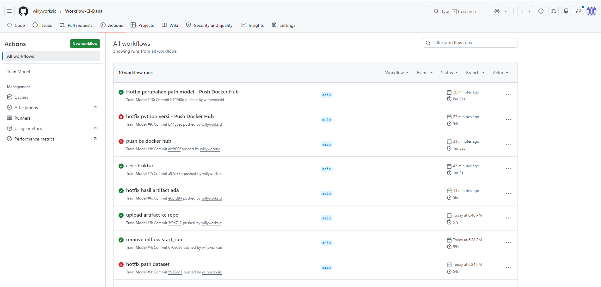
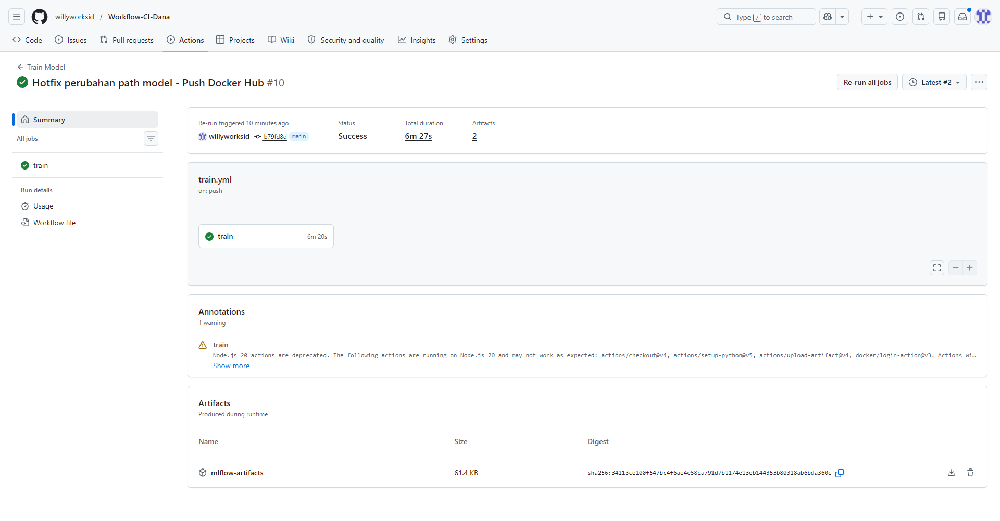
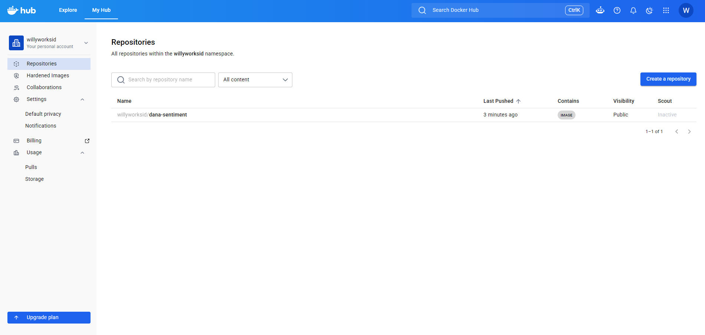

# Workflow CI - Sentiment Analysis DANA

Repository ini digunakan untuk memenuhi Kriteria 3 (Workflow CI) pada submission Machine Learning Operations.

## Teknologi

- MLflow
- Scikit-Learn
- GitHub Actions
- Docker
- Docker Hub

## Struktur Project

```text
.
├── .github/workflows/train.yml
├── MLProject
│   ├── MLproject
│   ├── conda.yaml
│   ├── modelling.py
│   └── dataset_preprocessing.csv
└── README.md
```

## Workflow

Workflow akan berjalan otomatis ketika terdapat push ke branch `main`.

Tahapan workflow:

1. Menjalankan MLflow Project
2. Melatih model Logistic Regression
3. Menyimpan artifact MLflow
4. Build Docker Image menggunakan MLflow
5. Push Docker Image ke Docker Hub

## Docker Hub

https://hub.docker.com/r/willyworksid/dana-sentiment

## Bukti Workflow

### GitHub Actions



### MLflow Artifact



### Docker Hub

